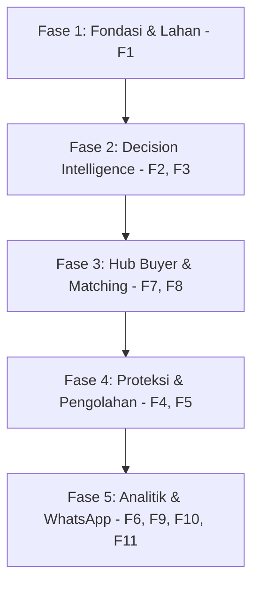

# Roadmap Pengembangan Tani Pintar

Dokumen ini melacak status pengembangan untuk masing-masing modul fitur yang diturunkan dari SRS Tani Pintar v1.0.

## 📌 Status Fitur & Penomoran Cabang (Branching)

Aturan Mutlak: **1 Fitur = 1 Branch**. Jangan menggabungkan beberapa modul fitur dalam satu branch.

| Fitur | Nama Modul / Fitur | Prioritas | Target Peran | Status | Branch Terkait | Catatan |
| :--- | :--- | :--- | :--- | :--- | :--- | :--- |
| **F1** | Onboarding & Profil Lahan | **Must Have** | Petani | 🟡 *In Progress* | `feature/f1-onboarding-lahan` | Halaman onboarding & setup lahan dasar petani. |
| **F2** | Harvest Timing Optimizer | **Must Have** | Petani | 🔴 *Not Started* | `feature/f2-harvest-timing` | Grafik proyeksi harga & rekomendasi waktu panen BMKG. |
| **F3** | Sell Destination Matcher | **Must Have** | Petani | 🔴 *Not Started* | `feature/f3-sell-destination` | Peta & kalkulasi margin bersih logistik ke pembeli. |
| **F4** | Preservation Recommender | **Should Have** | Petani | 🔴 *Not Started* | `feature/f4-preservation` | Panduan preservasi saat harga/cuaca tidak ideal. |
| **F5** | Waste Value Recovery | **Could Have** | Petani | 🔴 *Not Started* | `feature/f5-waste-recovery` | Rekomendasi olahan alternatif hasil panen rusak. |
| **F6** | Riwayat & Analitik Pribadi | **Should Have** | Petani | 🔴 *Not Started* | `feature/f6-riwayat-analitik` | Log perbandingan keputusan aktual vs proyeksi. |
| **F7** | Demand Listing | **Should Have** | Buyer | 🔴 *Not Started* | `feature/f7-demand-listing` | Post kebutuhan komoditas (volume, tenggat, lokasi). |
| **F8** | Sale List & Auto-Matching | **Could Have** | Buyer | 🔴 *Not Started* | `feature/f8-auto-matching` | Filter dan pencocokan pasokan dengan kelayakan shelf life. |
| **F9** | Notifikasi Proaktif (WA) | **Should Have** | Petani | 🔴 *Not Started* | `feature/f9-wa-notifications` | Pengaturan & status koneksi WhatsApp Bot di profil. |
| **F10**| Quick Query (WA) | **Could Have** | Petani | 🔴 *Not Started* | `feature/f10-wa-query` | Handled by backend, status integrasi di frontend. |
| **F11**| Dashboard Agregat Wilayah | **Could Have** | Admin/NGO | 🔴 *Not Started* | `feature/f11-dashboard-admin` | Heatmap oversupply regional & volume diselamatkan. |

---

## 📈 Alur Fase Pengembangan (Phase Milestones)

*   **Fase 1 (Onboarding):** Fokus mengumpulkan data koordinat lahan dan jenis komoditas secara akurat.
*   **Fase 2 (Rekomendasi Petani):** Membantu petani menentukan waktu panen terbaik dan pembeli paling menguntungkan secara logistik.
*   **Fase 3 (Sisi B2B):** Menghubungkan kebutuhan pembeli langsung ke pasokan petani untuk menutup celah asimetri pasar.
*   **Fase 4 (Mitigasi Kerugian):** Menyelamatkan pangan yang tidak terserap segar menjadi olahan atau pakan.
*   **Fase 5 (Skalabilitas):** Pelaporan agregat wilayah untuk dinas terkait/NGO dan dashboard analitik historis personal.
