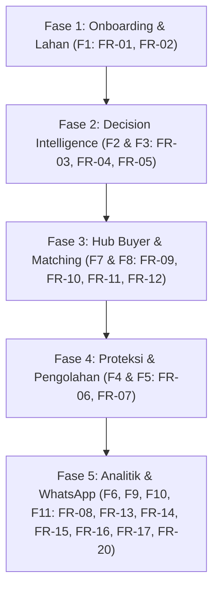

# Peta Jalan Pengembangan Tani Pintar

Dokumen ini melacak status pengembangan untuk masing-masing modul fitur yang diselaraskan dengan dokumen **Software Requirement Document (SRD) Tani Pintar v1.0**.

---

## 📌 Status Fitur & Penomoran Kebutuhan (Git Branching)

Aturan Mutlak: **1 Fitur = 1 Branch**. Jangan menggabungkan beberapa modul fitur dalam satu branch.

| Fitur | ID SRD | Nama Modul / Fitur | Prioritas | Target Peran | Status | Branch Terkait | Catatan |
| :--- | :--- | :--- | :--- | :--- | :--- | :--- | :--- |
| **F1** | `FR-01` `FR-02` | Onboarding & Profil Lahan | **Must Have** | Petani | 🟡 *In Progress* | `feature/f1-onboarding-lahan` | Registrasi nomor HP + OTP 6-digit & CRUD lahan di peta. |
| **F2** | `FR-03` `FR-04` | Harvest Timing Optimizer | **Must Have** | Petani | 🔴 *Not Started* | `feature/f2-harvest-timing` | Input rencana panen, grafik proyeksi harga & rekomendasi BMKG. |
| **F3** | `FR-05` | Sell Destination Matcher | **Must Have** | Petani | 🔴 *Not Started* | `feature/f3-sell-destination` | Peta & kalkulasi margin bersih logistik ke pembeli. |
| **F4** | `FR-06` | Preservation Recommender | **Should Have** | Petani | 🔴 *Not Started* | `feature/f4-preservation` | Panduan preservasi saat harga/cuaca tidak ideal. |
| **F5** | `FR-07` | Waste Value Recovery | **Could Have** | Petani | 🔴 *Not Started* | `feature/f5-waste-recovery` | Rekomendasi olahan alternatif hasil panen rusak. |
| **F6** | `FR-08` | Riwayat & Analitik Pribadi | **Should Have** | Petani | 🔴 *Not Started* | `feature/f6-riwayat-analitik` | Log keputusan panen/jual dan perbandingan hasil riil vs proyeksi. |
| **F7** | `FR-09` `FR-10` | Demand Listing | **Should Have** | Buyer | 🔴 *Not Started* | `feature/f7-demand-listing` | Post kebutuhan komoditas (volume, tenggat, lokasi). |
| **F8** | `FR-11` `FR-12` | Sale List & Auto-Matching | **Could Have** | Buyer | 🔴 *Not Started* | `feature/f8-auto-matching` | Antrean Sale List otomatis & pencocokan kelayakan logistik. |
| **F9** | `FR-13` | Notifikasi Proaktif (WA) | **Should Have** | Petani | 🔴 *Not Started* | `feature/f9-wa-notifications` | Alert otomatis WhatsApp bila potensi oversupply wilayah dideteksi. |
| **F10**| `FR-14` `FR-15` `FR-20` | Quick Query (WA) | **Could Have** | Petani | 🔴 *Not Started* | `feature/f10-wa-query` | Tanya harga/status lewat chat, validasi nomor, & manajemen sesi. |
| **F11**| `FR-16` `FR-17` | Dashboard Agregat Wilayah | **Could Have** | Admin/NGO | 🔴 *Not Started* | `feature/f11-dashboard-admin` | Heatmap oversupply regional & manajemen verifikasi akun. |

### 🛠️ Kebutuhan Lintas Modul (Backend Integration)
*   **`FR-18` (Autentikasi & Otorisasi RBAC)**: Pembatasan akses API berdasarkan JWT Token Cookie untuk peran `petani`, `buyer`, dan `admin`.
*   **`FR-19` (Pipeline Data Eksternal Terjadwal)**: Penarikan berkala data harga pangan BAPANAS/PIHPS dan data cuaca BMKG.

---

## 📈 Alur Fase Pengembangan (Phase Milestones)

*   **Fase 1 (Onboarding):** Fokus mengumpulkan data koordinat lahan dan jenis komoditas secara akurat.
*   **Fase 2 (Rekomendasi Petani):** Membantu petani menentukan waktu panen terbaik dan pembeli paling menguntungkan secara logistik.
*   **Fase 3 (Sisi B2B):** Menghubungkan kebutuhan pembeli langsung ke pasokan petani untuk menutup celah asimetri pasar.
*   **Fase 4 (Mitigasi Kerugian):** Menyelamatkan pangan yang tidak terserap segar menjadi olahan atau pakan.
*   **Fase 5 (Skalabilitas):** Pelaporan agregat wilayah untuk dinas terkait/NGO dan dashboard analitik historis personal.
